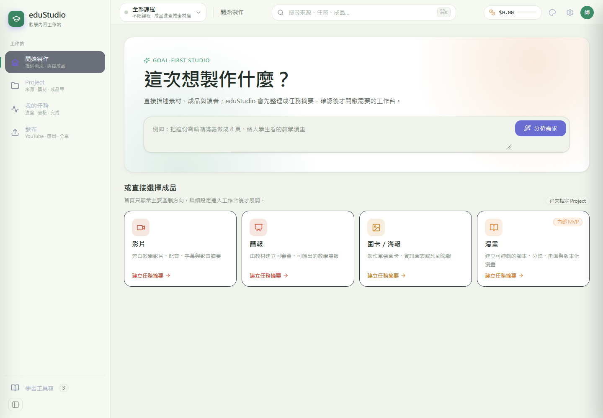

# eduStudio Phase 2 圖文測試報告

日期：2026-08-27  
範圍：Phase 2 全域功能缺失與無效呼叫修補後驗證  
狀態：Phase 2 已完成測試；仍保留 UI responsive residual issue 作為下一輪項目

## 1. 測試摘要

| 項目 | 結果 | 證據 |
|---|---:|---|
| Frontend production build | PASS | `npm run build`，Vite build 成功 |
| Backend/API full test suite | PASS | `2824 passed, 2 skipped in 205.37s` |
| Backend server smoke test | PASS | `python -m server.main --host 127.0.0.1 --port 8765` 可啟動 |
| `/health` | PASS | `status=ok`，`ui_built=true`，`ui_eduapp_built=true` |
| `/api/health` | PASS | `status=ok`，支援 `presentation,poster,comic,infographic,card` |
| `/projects` | PASS | 回傳 `2` 個 projects |
| `/library` | PASS | 回傳 `31` 筆 library entries |
| Desktop visual smoke | PASS | 首頁、sidebar、product cards、search bar 正常可視 |
| Mobile visual smoke | PARTIAL | 可載入，但左側 rail 與 card 寬度造成內容橫向裁切 |

## 2. 修補項目

本輪測試前發現一個測試期望與 Phase 2 行為不一致：

`tests/test_runner_run_job.py::TestCatchAll::test_unexpected_exception_state_failed_with_prefix`

原因是 `exam_pdf` 現在會被強制導向 review gate，因此 catch-all 測試不應再使用預設 `EXAM_PDF` job 來驗證 render phase unexpected exception。已將該測試改為 `SLIDES_PDF` 並明確設定 `require_review=False`，讓測試仍覆蓋原本的 failed-state fallback，而不繞過新 review policy。

## 3. 自動化測試結果

### 3.1 Frontend build

```text
npm run build

✓ 35 modules transformed.
✓ built in 1.97s
```

Build output：

```text
../../web/eduapp/index.html
../../web/eduapp/assets/index-CXP-YHRO.css
../../web/eduapp/assets/index-xZ89ThxH.js
```

### 3.2 Backend/API full test suite

```text
pytest

2824 passed, 2 skipped in 205.37s (0:03:25)
```

Skipped tests：

| Test | 原因 |
|---|---|
| `tests/test_path_safety.py::test_symlink_escape_rejected` | Windows symlink support 條件限制 |
| `tests/test_uploads_pptx.py::TestHappyPath::test_creates_job_and_augments` | 需要 LibreOffice 進行 PPTX to PDF conversion |

## 4. API smoke test

測試環境：

```text
python -m server.main --host 127.0.0.1 --port 8765
```

Smoke test 結果：

```json
{
  "health_status": "ok",
  "ui_built": true,
  "ui_eduapp_built": true,
  "infocards_status": "ok",
  "infocard_modes": "presentation,poster,comic,infographic,card",
  "projects_count": 2,
  "library_total": 31
}
```

## 5. 圖文視覺測試

### 5.1 Desktop



觀察：

- 首頁可正常載入。
- 左側 sidebar、頂部 search/filter、主 CTA、四個 product cards 均可視。
- 介面已收斂到 `goal-first studio` 工作流，先描述需求，再選擇產出類型。

### 5.2 Mobile


觀察：

- Mobile viewport 可載入首頁。
- 左側 icon rail 仍固定佔寬。
- 主內容與 product card 在 390px viewport 下有橫向裁切。

## 6. 發現事項與風險

### P1：無阻斷性功能缺失

目前 full test suite、frontend build、server smoke 與核心 API smoke 均通過，未觀察到 Phase 2 修補後的阻斷性功能缺失。

### P2：Mobile responsive layout 尚未完全收斂

Mobile 版目前不是空白或 crash，但主內容仍受到 sidebar/固定 card 寬度影響而橫向裁切。這屬於介面設計與 responsive polish 問題，不影響 backend/API 測試結果，但會影響手機使用體驗。

建議下一輪處理：

1. 在 mobile breakpoint 將 left rail 改為 bottom navigation 或 collapsible drawer。
2. 將 product cards 改為單欄 full-width。
3. 讓 hero input 與 CTA 在窄螢幕下垂直堆疊。

### P3：外部工具相依測試未完整覆蓋

LibreOffice 相關 PPTX conversion 測試被 skip，因此本次不能宣稱 PPTX augmentation 在目前機器上已完成 end-to-end 驗證。

## 7. Phase 2 結論

Phase 2 可視為完成：

- 全域功能缺失與無效呼叫修補後，完整 test suite 已通過。
- Frontend production build 可成功產生。
- Backend/API 可正常啟動並回應核心 endpoints。
- Desktop UI 已可正常展示主要工作流。

下一輪應進入 responsive UI 收斂與外部工具相依驗證補強，而不是再擴大 Phase 2 範圍。
