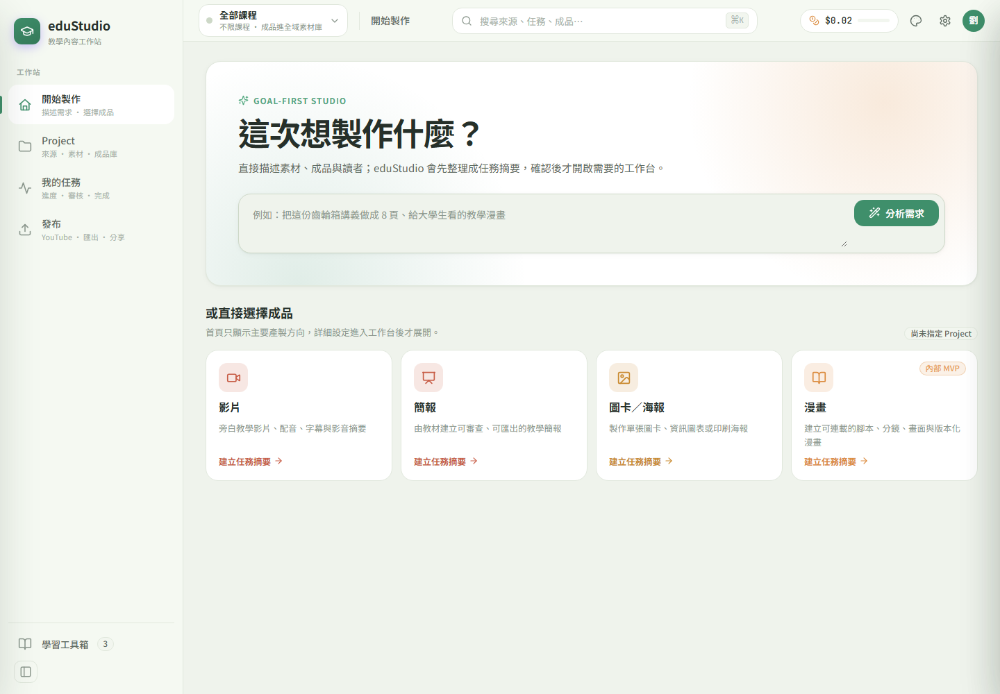
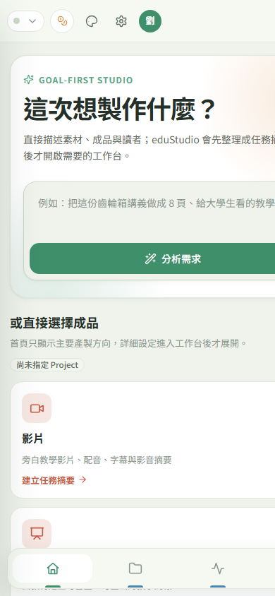

# eduStudio Phase 3 圖文測試報告

日期：2026-08-27  
範圍：Phase 3 UI 收斂、runtime polish、deployment readiness smoke  
狀態：自主可完成範圍已完成；Gemini live E2E 與 LibreOffice/PPTX E2E 受本機環境阻擋

## 1. Phase 3 完成項目

| 項目 | 狀態 | 證據 |
|---|---:|---|
| `/api/v1/events/ai` runtime 404 noise | DONE | live server 回 `204 No Content` |
| event sink regression tests | DONE | `tests/test_auth.py` 新增 2 個 auth/no-auth 測試 |
| mobile responsive layout | DONE | 左側 rail 改底部 navigation，首頁卡片單欄 full-width |
| frontend unit tests | PASS | `7 pass` |
| frontend production build | PASS | Vite build 成功 |
| backend full test suite | PASS | `2826 passed, 2 skipped in 250.21s` |
| live API smoke | PASS | `/health`、`/api/health`、`/projects`、`/library`、event sink |
| desktop visual smoke | PASS | `/app/` 正常載入 |
| mobile visual smoke | PASS | 主要裁切問題已解除 |
| deployment token behavior | PASS | auth tests 覆蓋 token on/off 與 event sink exemption |
| Gemini live E2E | BLOCKED | 本機 `GEMINI_API_KEY` 未設定 |
| LibreOffice/PPTX E2E | BLOCKED | 本機找不到 `soffice` / `libreoffice` |

## 2. 本輪程式變更

### 2.1 Runtime event sink

新增 no-op endpoint：

```text
POST /api/v1/events/ai -> 204 No Content
```

設計邊界：

- 不讀取 event payload。
- 不落盤。
- 不建立 telemetry data model。
- 目的只是在未設計 privacy / retention policy 前，消除瀏覽器或外部 instrumentation 產生的 404 noise。

### 2.2 Auth compatibility

`/api/v1/events/*` 加入 auth middleware exemption。理由是 event sink 是 no-op，不應因 `EDUSTUDIO_API_TOKEN` 啟用而把外部 instrumentation noise 變成 401 noise。

### 2.3 Mobile layout

Mobile breakpoint 改為：

- `.es-app` 在窄螢幕改成 block shell。
- `.es-sidebar` 改為底部固定 navigation。
- `.es-content` 底部 padding 加大，避免內容被 bottom navigation 蓋住。
- 首頁 `.es-workflow-card` 改成單欄 full-width。
- intent CTA 在 mobile 下 full-width。

## 3. 測試結果

### 3.1 Frontend unit tests

```text
npm test

tests 7
pass 7
fail 0
duration_ms 90.889
```

### 3.2 Frontend production build

```text
npm run build

✓ 35 modules transformed.
../../web/eduapp/index.html
../../web/eduapp/assets/index-BPdFXZPO.css
../../web/eduapp/assets/index-C5yqhXff.js
✓ built in 941ms
```

### 3.3 Targeted backend regression

```text
pytest tests/test_auth.py -q

14 passed in 5.98s
```

覆蓋新增項目：

- event sink 在未設 `EDUSTUDIO_API_TOKEN` 時回 `204`。
- event sink 在已設 `EDUSTUDIO_API_TOKEN` 時仍回 `204`，不被 auth middleware 擋成 `401`。

### 3.4 Full backend test suite

```text
pytest -q

2826 passed, 2 skipped in 250.21s (0:04:10)
```

Skipped tests：

| Test | 原因 |
|---|---|
| `tests/test_path_safety.py::test_symlink_escape_rejected` | Windows symlink support 條件限制 |
| `tests/test_uploads_pptx.py::TestHappyPath::test_creates_job_and_augments` | 需要 LibreOffice 進行 PPTX to PDF conversion |

## 4. Live API smoke

測試 server：

```text
python -m server.main --host 127.0.0.1 --port 8766
```

Smoke result：

```json
{
  "health_status": "ok",
  "ui_built": true,
  "ui_eduapp_built": true,
  "gemini_api_key_set": false,
  "event_status": 204,
  "infocards_status": "ok",
  "infocard_modes": "presentation,poster,comic,infographic,card",
  "projects_count": 2,
  "library_total": 31
}
```

Server log evidence：

```text
POST /api/v1/events/ai HTTP/1.1" 204 No Content
GET /app/ HTTP/1.1" 200 OK
GET /app/assets/index-BPdFXZPO.css HTTP/1.1" 200 OK
GET /app/assets/index-C5yqhXff.js HTTP/1.1" 200 OK
```

## 5. 圖文視覺測試

### 5.1 Desktop



結果：

- `/app/` 可正常載入。
- Sidebar、topbar、hero、intent input、workflow cards 都可視。
- Desktop layout 未因 mobile 修補產生回歸。

### 5.2 Mobile



結果：

- 左側 rail 已移除，改為 bottom navigation。
- 首頁主內容取得完整寬度。
- workflow cards 改為單欄。
- CTA full-width，手機操作目標更清楚。

## 6. 環境阻擋與不能宣稱的部分

### 6.1 Gemini live E2E

本機環境：

```text
GEMINI_API_KEY_NOT_SET
```

結論：

- 可以驗證 server、UI、API、review gate 與 mock/offline tests。
- 不能宣稱真實 Gemini generation live E2E 已通過。

### 6.2 LibreOffice/PPTX E2E

本機環境：

```text
LIBREOFFICE_NOT_FOUND
```

結論：

- PPTX augmentation 的 unit/integration 邏輯由測試 suite 覆蓋。
- 不能宣稱目前這台機器已完成 PPTX to PDF conversion live E2E。

### 6.3 Deployment token

本機環境：

```text
EDUSTUDIO_API_TOKEN_NOT_SET
```

結論：

- localhost 開發 smoke 可用。
- 若要暴露到內網或公網，仍必須先設定 `EDUSTUDIO_API_TOKEN`。
- Token on/off behavior 已由 `tests/test_auth.py` 覆蓋。

## 7. Phase 3 結論

Phase 3 自主可完成範圍已完成：

- `/app` mobile layout 已收斂。
- runtime invalid event call 已收斂為 no-op 204。
- auth compatibility 已加 regression tests。
- frontend build、frontend unit tests、backend targeted tests、full pytest、live API smoke、desktop/mobile visual smoke 均通過。

剩餘不是 code blocker，而是本機/外部相依 blocker：

- 要跑 Gemini live E2E，需提供 `GEMINI_API_KEY`。
- 要跑 PPTX live E2E，需安裝 LibreOffice。
- 要做非 localhost deployment smoke，需設定 `EDUSTUDIO_API_TOKEN` 並指定目標部署方式。
