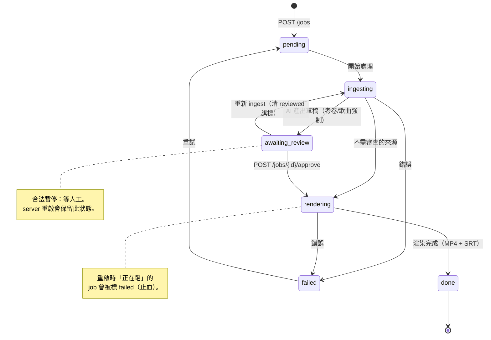

<div align="center">

# 📖 eduStudio 使用手冊 · User Manual

**教學內容工作站 — 完整操作參考**

繁中完整手冊 · [English Quick Reference](#-english-quick-reference)

</div>

> 這份是**完整參考手冊**(所有工作站、設定、API、疑難排解)。
> 只想**最短路徑 0→1**(裝起來 → 產第一支影片 → 上 YouTube)請看
> [`docs/onboarding.md`](onboarding.md);**正式上線 / 對外部署**看
> [`docs/DEPLOYMENT.md`](DEPLOYMENT.md);**想改 code / 貢獻**看
> [`CONTRIBUTING.md`](../CONTRIBUTING.md) 與 [`claude.md`](../claude.md)(硬規則)。

---

## 目錄

1. [eduStudio 是什麼](#1-edustudio-是什麼)
2. [安裝與啟動](#2-安裝與啟動)
3. [設定(環境變數 + 設定頁 + 模型)](#3-設定)
4. [核心概念(工作空間 · Job 生命週期 · 審查關卡 · 成本)](#4-核心概念)
5. [🎬 影片站](#5-影片站)
6. [🎨 視覺站](#6-視覺站)
7. [📚 漫畫站(內部 MVP)](#7-漫畫站內部-mvp)
8. [🌐 在地化站](#8-在地化站)
9. [📤 發布(YouTube)](#9-發布youtube)
10. [🗂️ 素材庫 · Library · 專案](#10-素材庫--library--專案)
11. [⌨️ CLI 與自動化](#11-cli-與自動化)
12. [🧯 疑難排解](#12-疑難排解)
13. [🔒 安全與上線](#13-安全與上線)
14. [附錄 A — 環境變數完整表](#附錄-a--環境變數完整表)
15. [附錄 B — REST API 速查](#附錄-b--rest-api-速查)
16. [附錄 C — Job 狀態機](#附錄-c--job-狀態機)
17. [FAQ](#faq)

---

## 1. eduStudio 是什麼

eduStudio 是一套**單一、可自架的 Python FastAPI 伺服器**,把老師的原始素材(考卷、講義、
文件、程式碼、音檔、相片)變成可發布的教學內容,而且**每個 AI 產出都有人工審查關卡**。
一個 Web 介面(`/app`)、一個可部署後端,涵蓋三大支柱:

| 🎬 影片 | 🎨 視覺 | 🌐 在地化 |
|---|---|---|
| 考卷 PDF → 黑板逐題解答影片 | 教學簡報(多主題、受眾/語氣引導) | 外部影片翻譯 / 重新配音 |
| 簡報 PDF → 逐頁旁白講解 | 資訊圖卡 & 印刷級海報 | 會議 / 演講錄音 → 摘要 |
| 文件 / Repo / 網址 → AI 大綱 → 影片 | 兩階段大綱 → 完整簡報 → PPTX | 歌曲 mp3 → 歌詞時間軸 → AI 生圖 MV |
| HTML 動畫 → 錄製 MP4 | 缺圖簡報 → AI 補配圖 | 單字卡(SM-2)、寫作批改 |
| 字幕(SRT)+ 一鍵 YouTube | PPTX 就地補圖(文字可編輯) | 單頁微調 + 自動圖表 |
| Google 相簿 → AI 選圖相片簡報 | — | — |

另有 **📚 教學漫畫工作站(內部 MVP,2026-08)**:連載式教學漫畫 — Series Bible、
證據鎖定生成、六道 QA gate、版本化發布與內部閱讀器,見 [§7 漫畫站](#7-漫畫站內部-mvp)。

**核心原則**:*絕不發布未經查證的 AI 數值*。AI 產出(尤其考題答案 / 數字)會停在**可編輯的
審查頁**,人工核准後才渲染。考卷解答一律強制審查、不可繞過。

---

## 2. 安裝與啟動

### 2.1 系統需求

| 類別 | 需要 | 說明 |
|---|---|---|
| 作業系統 | Linux / macOS / Windows | 任一皆可 |
| Python | 3.10+(建議 **3.12**) | 後端 |
| Node.js | 20+ | 只在**手動建置前端**時需要(Docker / 現成產物可免) |
| **ffmpeg / ffprobe** | 必裝(**非 pip**) | 任何影片 render / 抽音訊都要 |
| **Noto CJK 字型** | 中文渲染需要(**非 pip**) | 例 `fonts-noto-cjk` |
| **GEMINI_API_KEY** | 必填 | 唯一必填金鑰,<https://aistudio.google.com/apikey> |
| LibreOffice | 選用 | 只有 PPTX 來源功能(上傳 PPTX 補圖 / PPTX→影片)需要 |
| YouTube OAuth | 選用 | 只在要上傳 YouTube 時 |

> **用 Docker 的話**:ffmpeg 與 CJK 字型都已內建於 `Dockerfile`,你只要有 Docker。

### 2.2 安裝 — 兩條路

**A. Docker(最少踩雷)**

```bash
git clone <repo-url> eduStudio && cd eduStudio
cp .env.example .env                          # 填入 GEMINI_API_KEY=...
cp tts_config.example.json tts_config.json    # 預設 edge-tts 即可
docker compose up -d --build                  # 第一次會 build(含 ffmpeg + 字型)
```

**B. 本機 Python(想改 code / 開發)**

```bash
git clone <repo-url> eduStudio && cd eduStudio
python -m venv .venv && source .venv/bin/activate   # Windows: .venv\Scripts\activate
pip install -r requirements.txt                     # 核心依賴,裝這個就能跑
cp .env.example .env                                # 填 GEMINI_API_KEY
cd frontend && npm install && npm run build && cd ..   # 產出 /app(base 已寫死 /app/)
```

**依賴分層**(只裝你會用到的):

| 分層 | 安裝 | 加了什麼 |
|---|---|---|
| 核心 | `pip install -r requirements.txt` | Server + 影片/視覺/在地化文字 pipeline |
| 選用 | `pip install -r requirements-optional.txt` | PPTX 匯出、語音轉文字(faster-whisper)、F5-TTS |
| song | `pip install -r requirements-song.txt` | 歌曲 MV 軸(Demucs + WhisperX,重、數 GB) |
| dev | `pip install -r requirements-dev.txt` | 測試套件(pytest / httpx) |

### 2.3 啟動 server ⚠️ 重點

FastAPI 的 app 在 **`server/main.py`**。正確啟動指令(從專案**根目錄**執行):

```bash
uvicorn server.main:app --host 127.0.0.1 --port 8000
# 或等價:
python -m server.main --host 127.0.0.1 --port 8000
# 開發自動重載:
uvicorn server.main:app --reload --host 127.0.0.1 --port 8000
```

> ⚠️ **常見錯誤**:打成 `uvicorn main:app` 會報 `Error loading ASGI app. Could not import
> module "main"` —— 因為專案**沒有根目錄 `main.py`**,module 路徑必須是 `server.main:app`
> (中間是點)。文件、Docker、CI 全部用這條。

啟動後打開 **`http://127.0.0.1:8000/app/`**(注意結尾的 `/app/`)。

### 2.4 啟動自檢

server 啟動時會印一輪**自檢**:ffmpeg / 字型 / API key 在不在,缺什麼會在 log 標紅——
起不來或中文變方框時**先看那段**。

### 2.5 介面路徑

| 路徑 | 用途 | |
|---|---|---|
| **`/app/`** | 統一工作站:目標導向首頁(輸入需求自動歸類)+ 影片 · 簡報 · 圖卡 · 漫畫 四工作站 + 專案/發布/狀態 | 主要 |
| `/docs` | 自動產生的 OpenAPI 互動文件 | |
| `/api` `/localization` `/projects` `/jobs` … | REST 後端 | |
| `/health` | 健康檢查(回布林,給監控 / Docker healthcheck) | |
| `/studio` `/ui` | 舊版獨立 UI(保留參考) | legacy |

---

## 3. 設定

### 3.1 唯一必填:GEMINI_API_KEY

兩種設法(擇一):
1. **環境變數 / `.env`**(推薦自架):`.env` 寫 `GEMINI_API_KEY=你的key`,重啟生效。
2. **App 設定頁**:`/app` → 右上齒輪 → 貼上 key 存檔。

### 3.2 強烈建議:EDUSTUDIO_API_TOKEN(存取驗證)

- **沒設** → server 照跑但**零驗證**,只適合純 localhost 自用;啟動會大聲警告。
- **設了** → 一個 middleware 擋下所有請求。瀏覽器走登入框種 cookie;CLI 帶
  `Authorization: Bearer <token>`。
- **把 server 暴露到內網 / 公網前,務必先設一段夠長的隨機字串。**

### 3.3 模型設定(設定頁可逐角色挑)

**文字模型三階**:

| 階 | id | 用途 |
|---|---|---|
| ⚡ 主力 | `gemini-3.7-flash` | 一般生成(大綱/旁白/翻譯/解題),最新主力(**預設**,2026-08-30 遷) |
| 🪶 最省 | `gemini-3.1-flash-lite` | 最低成本,簡單任務 |
| 🚀 深度推理 | `gemini-3.1-pro-preview` | 最強推理,複雜內容 / 長文 |

**圖片模型三階**(對齊 Gemini 官方 Nano Banana 三階):

| 階 | id | 官方名 |
|---|---|---|
| 💲 便宜 | `gemini-3.1-flash-lite-image` | Nano Banana 2 Lite |
| ⚡ 中等(**預設**) | `gemini-3.1-flash-image` | Nano Banana 2 |
| 👑 貴 | `gemini-3-pro-image` | Nano Banana Pro |

> 模型 id 的單一目錄在 `core/infocards/models.py`,`core/models.py` 的角色引用它。
> 換模型只改該檔。**新 model id 上線前務必 live 實測**(此 repo 有 preview id 非 GA、
> 實測 404 的前科;用 `client.models.list()` 查該 key 真正可用的)。

**本機 Ollama(零雲端成本,2026-08 已 live 驗證)**:文字角色可**逐角色指向本機 Ollama** —
設定頁 `model_roles` 用巢狀寫法 `{"provider": "ollama", "model": "qwen3:4b"}`(model 換成你
本機有的);指到 Ollama 的角色**不會呼叫 Gemini**。Ollama 位址用 `OLLAMA_HOST` 指定
(預設 `http://localhost:11434`)。

### 3.4 其他常用設定

完整清單見[附錄 A](#附錄-a--環境變數完整表)。最常用:

- `TTS_PROVIDER=edge`(預設)/ `f5`(本機聲音複製,首次下載 ~1.3GB)。
- `EDUSTUDIO_RATE_LIMIT_PER_MIN=30`(燒額度端點的 per-IP 每分鐘上限)。
- `EDUSTUDIO_MONTHLY_BUDGET=30`(成本面板月預算基準,純顯示,不真的擋)。
- `CLAUDE_FONT_PATH` 等(字型路徑覆寫)。
- `CLAUDE_COVER_*` / `CLAUDE_OUTRO_*`(影片片頭片尾品牌,設定頁亦可設且優先)。

---

## 4. 核心概念

### 4.1 一門課＝一工作空間

頂欄選一門課(或新建),之後產的每支影片 / 每張圖卡都自動歸到該課的**來源 · 任務 · 成品**,
NotebookLM 式管理。

### 4.2 Job 生命週期(狀態機)

所有生成都是一個 **job**,狀態流轉:

```
pending → ingesting → awaiting_review →(核准)→ rendering → done
                    ↘（不需審查來源直接）↗                    ↘ failed（可重試）
```

- `awaiting_review`(待審查)是**合法暫停**,等人工;`done` / `failed` 是終態。
- **重啟止血**:server 重啟會把「正在跑」(pending/ingesting/rendering)的 job 標 `failed`
  請重試;`awaiting_review` 的會**保留**。詳見[附錄 C](#附錄-c--job-狀態機)。

### 4.3 人工審查關卡(核心價值)

- 考卷(`exam_pdf`)與歌曲(`song`)**強制審查**、不可用參數或 CLI 繞過。
- 審查頁逐段顯示 AI 產出 + 信心標記,可**就地編輯**錯的數字 / 公式 / 旁白。
- `review_assist` 會對可計算的步驟做算術校驗、標記可疑處(只標記不阻擋)。

### 4.4 成本面板

`/app` 有成本面板,讀 `core/usage.py` 的真實用量統計(視覺 / 在地化 / 影片 Gemini
chokepoint),依 `EDUSTUDIO_MONTHLY_BUDGET` 顯示花到預算的幾 %。
> 註:目前為**估算**(以 Google 官方定價為準),不會真的扣費或擋下呼叫。

---

## 5. 影片站

同一條 pipeline 吃多種來源(source type),終點都是 MP4 + SRT,可上 YouTube。

| 來源 | source_type | 產出風格 | 是否強制審查 |
|---|---|---|---|
| 考卷 PDF | `exam_pdf` | 黑板逐題解答 | ✅ 強制 |
| 簡報 PDF | `slides_pdf` | 投影片原圖 + 逐頁旁白 | 預設否 |
| 文件(PDF/Doc) | `document` | AI 大綱 → Forest 主題簡報講解 | 預設否 |
| 網址 | `url` | 抓網頁 → 大綱 → 講解 | 預設否 |
| 程式碼 repo | `repo` | 讀 repo → 大綱 → 講解 | 預設否 |
| HTML 動畫 | `html` | 虛擬時鐘無頭逐格擷取 → fps 精準 MP4 | 預設否 |
| Google 相簿 | `google_photos` | AI 選圖 + 配文相片簡報 | 走審查 |
| 歌曲 mp3 | `song` | 歌詞時間軸 + AI 生圖 MV | ✅ 強制 |

**GUI 流程**(以考卷為例):

1. 頂欄**選課**。
2. **影片頁籤 → 新建** → 來源類型選**考卷** → 上傳 PDF。
3. 開始 → 狀態 `ingesting`(AI 看 PDF、OCR、解題)→ 停在 **`awaiting_review`**。
4. **逐題審查**:檢查每一步的數字 / 公式 / 旁白,就地改錯 → 按 **核准**。
5. 狀態轉 `rendering`(合成、燒字幕、配旁白)→ `done`。
6. 任務卡 / 發布頁**預覽、下載 MP4 + SRT**。

> **第一次較慢**:F5-TTS 首次下載模型、Gemini 解題需時。急著看結果可把 TTS 設 `edge`。

**進階選項**(建 job 時):TTS 後端、narration 風格(academic / storyteller / …)、
主題、片頭片尾、字幕燒錄與否等。

---

## 6. 視覺站

從一句主題或一份大綱,產出**簡報 / 資訊圖卡 / 海報**,可匯出 PPTX 或轉影片。

- **教學簡報**:兩階段(先大綱 → 再完整每頁)+ 多主題 + 受眾 / 目的 / 語氣 / 視覺取向引導。
  端點 `POST /api/generate`;匯出 `POST /api/export/pptx`。
- **資訊圖卡 / 海報**:直式海報 · 方形圖卡 · 橫式,可自訂 prompt / 張數 / 密度 / 字型 / 長寬比。
- **缺圖簡報補圖**:上傳缺圖簡報(PDF 或 PPTX),偵測純文字頁 → 生配圖 → **智慧置入原頁空白**
  (原頁不縮小;PPTX 則原檔插圖、**原文字仍可編輯**)。
- **單頁微調**:`POST /api/refine`(整頁)/ `/api/refine-section`(段落),自動圖表 / 架構圖。
- **素材庫**:視覺成品成功即自動存 `visual_library`,可回頭取用(`GET /api/visual-library`)。

---

## 7. 漫畫站(內部 MVP)

把教學內容做成**連載式教學漫畫**。與影片 / 視覺共用 Project、設定、AI provider 與成本
紀錄,但以獨立 Comic Core 管理連載、版本、證據與發布規則(file-first:磁碟上的
`manifest.json` 是單一真相)。完整設計見
[`COMIC_PRODUCTION_SYSTEM.md`](COMIC_PRODUCTION_SYSTEM.md)。

**流程**:

1. `/app` 首頁輸入需求(例:「把這份齒輪箱講義做成 8 頁教學漫畫」),或直接選**漫畫**。
2. 選 Project → 建立或選擇 **Series**(連載)與 **Episode**(單集)。
3. 在 **Series Bible** 維護世界觀、角色 visual lock、角色 voice 與 glossary。
4. 產生或編輯 script、storyboard、camera、learning point、對白與 alt text。
5. 建立 **Evidence Pack**;AI prompt 會攜帶角色與世界觀 lock。
6. 逐頁生成或上傳 scene asset(對白不烙進圖片,保留 34–38% negative space 排版)。
7. 過 **六道 QA gate**:anatomy / technical / text / safety / page_render / human_approval。
8. 只有 validation **PASS** 的版本能進 `CURRENT`,只有 `CURRENT` 能發布到內部閱讀器。
9. 匯出 HTML / PDF / DOCX / source ZIP;發布後可撤回 release,改內容必須 fork 新版本。

**Fail-closed 規則**:mock 圖、缺 evidence、缺 scene、缺 alt text、缺 QA 或未人工核准
一律不可發布;已核准版本(`CURRENT`)不可就地改稿。

> API 走 `/projects/{pid}/comics/*`(series / episodes / generate / evidence / QA /
> exports / publish / reader),見[附錄 B](#附錄-b--rest-api-速查)。

---

## 8. 在地化站

| 功能 | 端點 | 說明 |
|---|---|---|
| 影片翻譯 / 重新配音 | `POST /localization/dub` | 外部影片抽音 → 翻譯 → 重配音 |
| 文字 / 圖片 / PDF 翻譯 | `POST /localization/translate[/image|/pdf]` | 保留版面 |
| 會議 / 演講摘要 | `POST /localization/meeting/summarize` | 錄音 → 重點摘要 |
| 歌曲轉錄 | `POST /localization/song/transcribe` | 歌詞時間軸(WhisperX) |
| 學習工具 | `POST /localization/learning/*` | 單字卡(SM-2)、翻譯、寫作批改、聽寫檢查、會話 |

> 在地化可走**本機 Ollama**(設 `OLLAMA_HOST`),本機失敗預設自動退回雲端 Gemini
> (`LOCAL_MODEL_FALLBACK=1`);隱私 / 離線場景可設 `0` 為嚴格本機。

---

## 9. 發布(YouTube)

### 9.1 一次性:OAuth 憑證

1. [Google Cloud Console](https://console.cloud.google.com/) 建專案 → 啟用 **YouTube Data API v3**。
2. 建 **OAuth client ID**(桌面應用程式),下載 JSON。
3. 把 JSON **原封不動**放到專案根目錄(檔名通常 `client_secret_xxx.json`,**不用改名**,
   系統自動配對)。已被 `.gitignore`。

### 9.2 上傳

- **GUI**:發布頁對已 `done` 的影片按「發布到 YouTube」。第一次跳瀏覽器授權,token 存
  `youtube_token.json`(gitignore,自動 refresh)。含自動章節、標題 / 說明。
- **多語字幕**:翻譯既有 SRT → 上傳多語 caption track(`POST /jobs/{id}/artifacts/{name}/captions`)。
- **CLI**:`python publish.py --video output/<stem>/q1.mp4 --title "..."`。

> YouTube 配額:一次上傳約 1,600 units / 日上限 10,000(約 6 支/天),到頂隔天重置。

---

## 10. 素材庫 · Library · 專案

- **`/library`**:跨考卷 / 跨 job 瀏覽成品(含 path traversal 防護)。
- **專案(`/projects`)**:一課一工作空間;建課、匯入來源、多課切換、詞彙表(glossary)、
  筆記(notebook)、成品歸屬。
- **版本**:job 產出可留多版(`GET /jobs/{id}/versions`)。

---

## 11. CLI 與自動化

server 要先啟動。排程 / 自動化可用 wrapper:

```bash
python scripts/submit_job.py exam ./midterm.pdf          # 考卷(預設需審查)
python scripts/submit_job.py document ./lecture.pdf      # 講義
python scripts/submit_job.py url https://example.com/x   # 網頁
python scripts/submit_job.py repo ./code-repo            # 程式碼倉庫
python publish.py --video output/<stem>/q1.mp4 --title "..."   # 上傳 YouTube
python batch.py ...                                      # 整份批次(見 --help)
```

> 考卷的 review gate **不能用 CLI 繞過**;審查與核准仍走 `/app`。

---

## 12. 疑難排解

| 症狀 | 處理 |
|---|---|
| `Could not import module "main"` | 啟動指令打錯 —— 用 `uvicorn server.main:app`(不是 `main:app`),見 §2.3 |
| `/app` 整頁空白 / 404 | 前端沒 build 或 base 不對:`cd frontend && npm install && npm run build`(base 已寫死 `/app/`),或用 Docker |
| server 啟動就掛 | 看 traceback,最常見 `GEMINI_API_KEY` 沒設 / google-genai 沒裝;啟動自檢 log 會標紅 |
| 中文變方框 / FFmpeg 找不到字型 | 沒裝 Noto CJK 或路徑不對:`apt install fonts-noto-cjk`,或設 `CLAUDE_FONT_PATH`(§3.4) |
| 渲染失敗:找不到 ffmpeg | ffmpeg/ffprobe 沒裝或不在 PATH:`apt/brew/choco install ffmpeg` |
| 第一支影片卡很久 | 正常:F5-TTS 首次下載 ~1.3GB + Gemini 解題需時;想快把 TTS 設 `edge` |
| `pip install` 卡在 PyMuPDF | Linux 可能要先 `apt install libmupdf-dev`;多數平台有預編 wheel |
| Gemini 呼叫 404 / 模型不存在 | model id 非 GA(preview 前科)。用 `client.models.list()` 查該 key 可用的,改 `core/infocards/models.py` |
| YouTube 找不到 `client_secret*.json` | OAuth JSON 沒放到專案根目錄(§9.1),檔名不用改 |
| YouTube `quotaExceeded` | 當日配額用盡(約 6 支/天),隔天重置 |
| 重啟後 job 標 failed | 重啟把「正在跑」的 job 標 failed 請重試(止血);`awaiting_review` 的會保留 |
| 暴露到內網 / 公網安全嗎 | **預設零驗證**,只適合 localhost;對外先設 `EDUSTUDIO_API_TOKEN` + 反向代理 + TLS,見 §13 |
| PPTX 補圖 / 轉影片失敗 | 需 LibreOffice(`libreoffice-impress`),用來把 `.pptx` 渲成 PDF |

---

## 13. 安全與上線

自架自用(localhost)可直接跑。**要暴露到內網 / 公網前**務必:

1. 設 **`EDUSTUDIO_API_TOKEN`**(否則零驗證)。
2. base compose **綁 `127.0.0.1`**、對外一律走**反向代理 + TLS**(prod compose 已如此)。
3. 收斂 **CORS**(`EDUSTUDIO_ALLOWED_ORIGINS`)。
4. `url` 來源有 SSRF 面向、上傳有大小上限——完整清單見
   [`docs/CODE_REVIEW_2026-07.md`](CODE_REVIEW_2026-07.md) 的安全段。

完整上線步驟見 [`docs/DEPLOYMENT.md`](DEPLOYMENT.md)。安全漏洞回報走 [`SECURITY.md`](../SECURITY.md)。

---

## 附錄 A — 環境變數完整表

| 變數 | 必填? | 預設 | 用途 |
|---|---|---|---|
| `GEMINI_API_KEY` | ✅ 必填 | — | LLM 主要呼叫源 |
| `EDUSTUDIO_API_TOKEN` | 強烈建議 | 未設(零驗證) | 存取驗證共享密鑰 |
| `GOOGLE_APPLICATION_CREDENTIALS` | 選 | — | GCP service account(Vertex / GCP TTS) |
| `OLLAMA_HOST` | 選 | `http://localhost:11434` | 本機 LLM 後端 |
| `LOCAL_MODEL_FALLBACK` | 選 | `1`(開) | 本機模型失敗自動退雲端;`0`=嚴格本機 |
| `TTS_PROVIDER` | 選 | 讀 `tts_config.json`(edge) | 強制 TTS 後端(edge / f5) |
| `CLAUDE_FONT_PATH` | 選 | Docker 內建 Noto | 主字型路徑 |
| `CLAUDE_FALLBACK_FONT_PATH` | 選 | — | 符號 fallback 字型 |
| `CLAUDE_MONO_FONT_PATH` | 選 | — | 等寬字型 |
| `EDUSTUDIO_RATE_LIMIT_PER_MIN` | 選 | `30` | 燒額度端點 per-IP 每分鐘上限;`0`=關 |
| `EDUSTUDIO_ALLOWED_ORIGINS` | 選 | 本機 | CORS 白名單(逗號分隔);`*`=全開(不建議) |
| `EDUSTUDIO_MONTHLY_BUDGET` | 選 | `30`(USD) | 成本面板預算基準(純顯示) |
| `KEEP_TRACK_A` | 選 | 未設 | `1`=保留舊 Track A;預設根路徑 redirect |
| `TRACK_B_URL` | 選 | `http://localhost:8000` | 一般不需改 |
| `WHISPER_MODEL` / `WHISPER_DEVICE` | 選 | 自動 | SONG 自動對齊(WhisperX) |
| `CLAUDE_COVER_*` / `CLAUDE_OUTRO_*` | 選 | 內建 | 影片片頭片尾品牌(設定頁優先) |
| `ES_SETTINGS_PATH` / `USAGE_DB_PATH` / `HISTORY_DB_PATH` / `LEARNING_DB_PATH` / `SHARE_DB_PATH` / `VISUAL_LIBRARY_DB_PATH` | 選 | repo 內 | DB / 設定檔路徑(多機/多實例才需改) |
| `PROMPTS_NO_CACHE` | 選 | 未設 | `1`=關 prompt 快取(除錯) |

---

## 附錄 B — REST API 速查

> 完整互動文件在跑起來的 server 的 **`/docs`**(OpenAPI)。以下依 router prefix 分組速查。

| Prefix | 主要端點(節錄) |
|---|---|
| `/jobs` | `POST /jobs` 建 job · `GET /jobs/{id}` · `GET /jobs/{id}/draft` · `PUT /jobs/{id}/draft` · `POST /jobs/{id}/approve` · `GET /jobs/{id}/review-flags` · `GET /jobs/{id}/artifacts/{name}` · `GET /jobs/{id}/log` · `GET /jobs/{id}/versions` · `GET /jobs/{id}/pptx` · `POST /jobs/{id}/to-video` · `POST /jobs/{id}/sections/{sid}/render` |
| `/upload` | `POST /upload`(PDF)· `POST /upload/html` · `POST /upload/pptx` |
| `/api`(視覺) | `POST /api/generate` · `POST /api/refine` · `POST /api/refine-section` · `POST /api/export/pptx` · `GET /api/visual-library` · `POST /api/scan-folder` · `POST /api/share` · `GET /api/languages` |
| `/localization` | `POST /dub` · `POST /translate[/image|/pdf]` · `POST /meeting/summarize` · `POST /song/transcribe` · `POST /learning/{flashcards,translate,writing-correction,dictation-check,conversation}` |
| `/projects` | `GET/POST /projects` · `GET /projects/{id}` · `DELETE /projects/{pid}/sources/{sid}` · `GET/PUT /projects/{pid}/glossary` · `GET /projects/{pid}/notebook` |
| `/proposals` | ideation 提案:`POST /{id}/duplicate` · `PATCH /{id}/ignore` |
| `/jobs`(YouTube) | `POST /jobs/{id}/artifacts/{name}/publish` · `POST /jobs/{id}/artifacts/{name}/captions` · `GET …/youtube_status` · `GET …/youtube_meta` |
| `/settings` | `GET/PUT` 設定(API key / 逐角色模型 / 預算) |
| `/projects/{pid}/comics` | 漫畫:`POST /series` · `POST /episodes` · `POST /episodes/{id}/generate/{script,storyboard,images}` · `PUT …/evidence/{sid}` · `PUT …/qa/{gate}` · `GET …/validation` · `POST …/exports/{kind}` · `POST …/publish` · `GET /reader/{id}` |
| `/themes` `/voices` `/slide_images` `/google-photos` `/library` | 主題預覽 · 語音清單+試聽 · 簡報配圖 · 相簿 Picker · 成品瀏覽 |
| `/health` `/status` | 健康檢查 · 系統狀態 |

> 設了 `EDUSTUDIO_API_TOKEN` 時,除 `/auth` `/health` 外所有端點都需帶
> `Authorization: Bearer <token>`(或瀏覽器 cookie)。

---

## 附錄 C — Job 狀態機



---

## FAQ

**Q. 一定要有 GPU 嗎?** 不用。edge-tts 走雲端、Gemini 走 API;只有 F5-TTS 聲音複製與
SONG 的 WhisperX 建議 GPU(可 CPU,較慢)。

**Q. 一定要付 Gemini 費用嗎?** 起步用免費額度即可。成本面板幫你盯用量。

**Q. 資料會外流嗎?** 自架、離線優先——你的 key、你的機器、你的資料,不經第三方 SaaS。
唯一外連是你自己設定的 Gemini / GCP / YouTube。

**Q. 可以只用後端 API 不用 `/app` 嗎?** 可以,見[附錄 B](#附錄-b--rest-api-速查)與 `/docs`。
但考卷的 review gate 不能繞過。

**Q. Windows 可以嗎?** 可以(專案在 Windows 實際開發)。注意 bash 工具在 Windows 是 cp950,
curl 傳含中文的 JSON 會亂碼 → 用 Python urllib/requests(UTF-8)打 API。

**Q. 改了前端 / 後端要重啟嗎?** 前端 `npm run build` 即生效(server 直接 serve 產物),硬重新
整理 `/app`;改後端要**重啟 uvicorn**(開發用 `--reload` 自動重載)。

---

<div align="center">

## 🇬🇧 English Quick Reference

</div>

**What it is** — a single self-hostable FastAPI server that turns exams / slides / docs /
repos / audio / photos into narrated teaching videos, slide decks, infographics and
localized content, with a **human review gate over every AI output** (exam answers are
review-locked and cannot be bypassed). One web app (`/app`), one backend.

**Install & run**

```bash
# Docker (bundles ffmpeg + CJK fonts)
cp .env.example .env          # set GEMINI_API_KEY
docker compose up -d --build  # → http://localhost:8000/app/

# From source
pip install -r requirements.txt
cd frontend && npm install && npm run build && cd ..
uvicorn server.main:app --host 127.0.0.1 --port 8000   # → http://127.0.0.1:8000/app/
```

> ⚠️ The ASGI path is **`server.main:app`**, NOT `main:app` — there is no root `main.py`.
> `uvicorn main:app` fails with *"Could not import module 'main'"*.

**System prerequisites (not pip)**: `ffmpeg`/`ffprobe` (any render), Noto CJK fonts
(Chinese glyphs), LibreOffice (only PPTX-source features).

**Configuration** — only `GEMINI_API_KEY` is required. Set `EDUSTUDIO_API_TOKEN` before
exposing beyond localhost (otherwise **no auth**). Full table: [Appendix A](#附錄-a--環境變數完整表).

**Model tiers** — text: `gemini-3.7-flash` (default) / `gemini-3.1-flash-lite` /
`gemini-3.1-pro-preview`; image: **Nano Banana 2 Lite / 2 / Pro** =
`gemini-3.1-flash-lite-image` / `gemini-3.1-flash-image` / `gemini-3-pro-image`.
Verify any new id live before shipping.

**Core model** — every generation is a **job**: `pending → ingesting → awaiting_review →
(approve) → rendering → done`. Exam & song sources force the review gate.

**Three pillars** — 🎬 Video (exam / slides / doc / url / repo / html / photos / song →
MP4 + SRT → YouTube), 🎨 Visual (slides / infographics / posters → PPTX, image-less-deck
augment, per-slide refine), 🌐 Localization (video dub / translate / meeting summary /
flashcards / writing correction / song MV). Plus an internal **comic workstation**
(Series Bible, evidence-gated generation, six QA gates, versioned releases — see §7).

**Interfaces** — `/app/` (workstation), `/docs` (OpenAPI), `/health`, `/jobs` `/api`
`/localization` `/projects` … (REST). API map: [Appendix B](#附錄-b--rest-api-速查).

**Troubleshooting** — see the [疑難排解 table](#12-疑難排解) (symptoms are language-neutral:
`Could not import module "main"` → wrong ASGI path; blank `/app` → frontend not built;
tofu glyphs → missing CJK fonts; render fails → ffmpeg missing).

**Going to production** — [`docs/DEPLOYMENT.md`](DEPLOYMENT.md). **Getting started 0→1** —
[`docs/onboarding.md`](onboarding.md). **Contributing** — [`CONTRIBUTING.md`](../CONTRIBUTING.md).

---

<div align="center">

*eduStudio · © 2026 劉瑞弘 Juihung Liu · [MIT](../LICENSE) · [DOF Lab](https://doflab.cc)*

</div>
